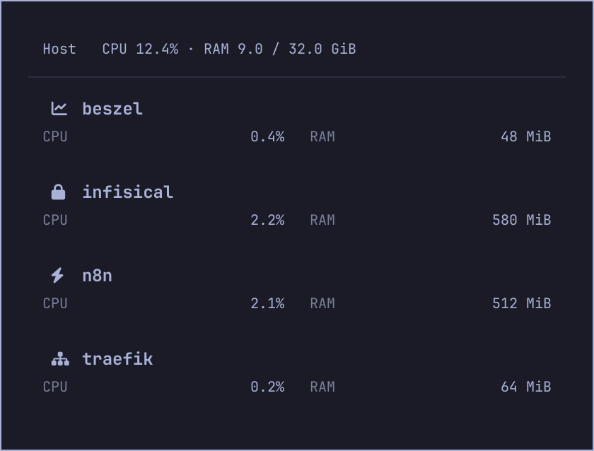
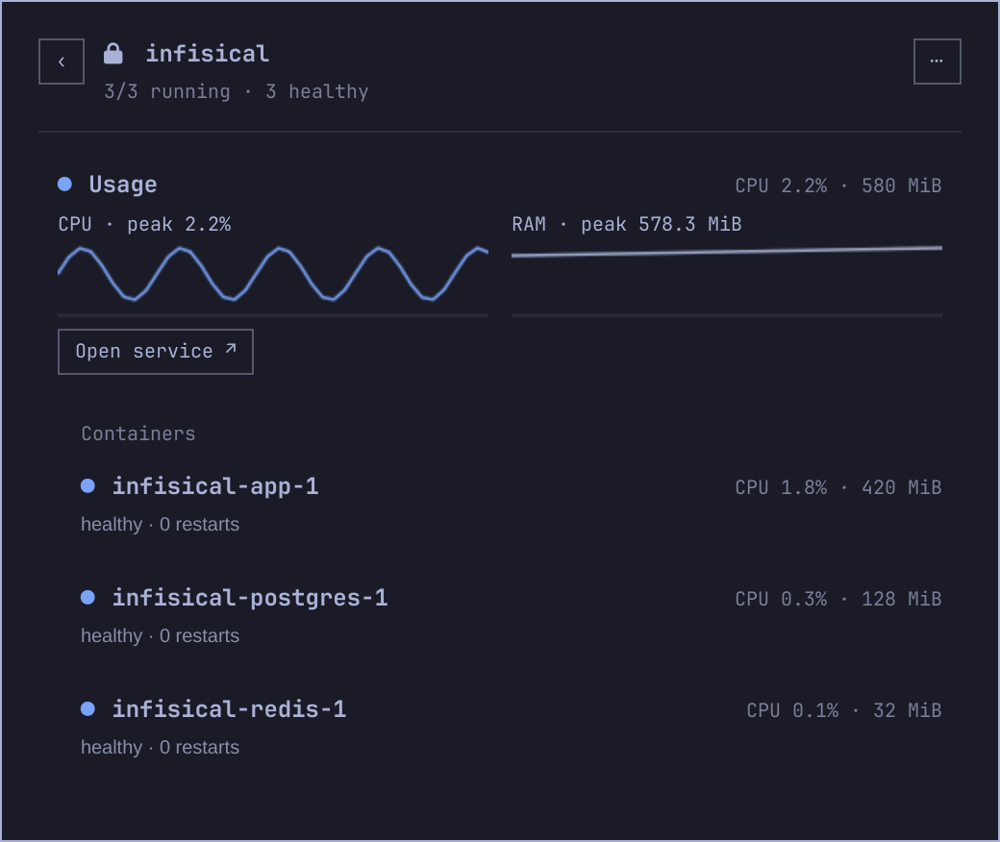
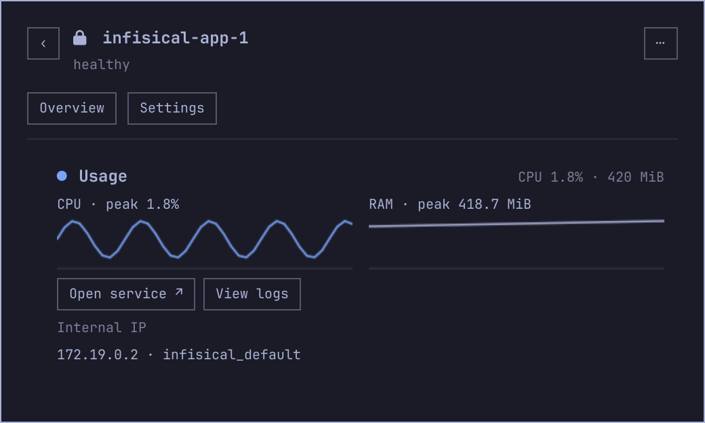

# Docker Monitor

A compact Docker dashboard for the Omarchy Quattro bar. Start with host CPU/RAM and active Compose groups, then open a group or container for details.



## Features

- Host CPU and used/total RAM, sampled only while the panel is open.
- Active groups with aligned CPU/RAM values, automatic service icons, and health indicators.
- Group overview with resource history, service links, and compact container rows.
- Separate container Overview and Settings pages.
- Internal IPv4/IPv6 addresses labeled by Docker network.
- Recent logs, start/stop/restart controls, custom group names, and URL overrides.
- RAM limits in Settings; the rest of the interface stays focused on monitoring.

<table>
<tr><td></td><td></td></tr>
</table>

[View Settings](docs/settings.png). Screenshots render the actual QML interface with synthetic service names, metrics, and addresses.

## Requirements

- Omarchy Quattro with its Quickshell shell and shared Ui/Commons components.
- Docker CLI and access to the Docker daemon from your desktop session.
- Python 3, Bash, awk, and GNU coreutils.
- Linux /proc for local host CPU and memory metrics.

No extra Python packages, background service, or telemetry. Service links open in your browser only when clicked. The widget uses the Docker context/environment inherited by the shell; host metrics always describe the local Linux machine. Prefer a local Docker context when comparing host and container metrics.

## Install

```sh
omarchy plugin add https://github.com/RohiRIK/omarchy-docker-monitor.git --enable
```

Plugin ID: `rohirik.docker-monitor`. To enable an already installed copy:

```sh
omarchy plugin enable rohirik.docker-monitor right
```

If you also use the original Docker widget, disable it to avoid duplicate icons:

```sh
omarchy plugin disable devgtv.docker
```

## Use

Click the Docker icon → select a group → select a container.

- **Groups:** only groups with a running, restarting, or paused container appear. A stopped group stays on its open detail page, so it can be started again before navigating away.
- **Group overview:** graphs, service links, and member containers. The `⋯` menu contains lifecycle actions and rename.
- **Container Overview:** resource history, network addresses, service access, and recent logs.
- **Container Settings:** group assignment, URL override, and RAM limit.
- **Back:** returns one page. Escape first closes an editor or log view, then goes back.
- **Keyboard:** j/k or arrows select rows; Enter opens a row; r refreshes. h/l adjust RAM only on a container's Settings page.

Container CPU follows Docker's convention and can exceed 100% on multi-core workloads. Host CPU is normalized across all cores. Host RAM uses MemTotal minus MemAvailable. Graphs retain the latest 60 samples collected while the panel is open; they are not a persistent monitoring database.

Memory changes apply through `docker update --memory … --memory-swap -1`. The slider applies on release; keyboard adjustments are debounced. Docker Compose may replace those limits when a container is recreated—keep durable limits in your Compose configuration.

Service icons are symbolic, selected from known service/image patterns, with a Docker fallback. They are not official service logos.

## Configuration

Set the refresh interval on the widget's entry in `~/.config/omarchy/shell.json`:

```json
{
  "id": "rohirik.docker-monitor",
  "refreshMs": 3000
}
```

The minimum is 500 ms. The default is 3000 ms.

Custom names, assignments, and URLs are stored in `~/.config/omarchy/rohirik-docker-monitor.json`. The plugin creates this file only when you save settings. It does not import or overwrite the original widget's preferences.

## Remove

```sh
omarchy plugin disable rohirik.docker-monitor
omarchy plugin remove rohirik.docker-monitor
```

Saved custom names and URLs remain in the preferences file; delete it separately if you want to discard them.

## Development and checks

```sh
bash test/run
omarchy plugin validate .
python3 tools/render-previews.py
```

Tests require Node.js; integration checks read the daemon and never start, stop, or change containers. If Docker cannot be reached, integration tests report a skip. The screenshot tool needs the installed Omarchy shell, runs an isolated offscreen renderer with synthetic data, and never captures your desktop or uses your Docker daemon.

## Credits and license

Derived from [devgtv/omarchy-docker](https://github.com/devgtv/omarchy-docker), by devgtv. This version adds group-first navigation, host metrics, container pages, internal addresses, service detection, health/URL controls, and presentation work.

MIT licensed. The original copyright and permission notice are preserved in [LICENSE](LICENSE); modifications are credited to RohiRIK.
